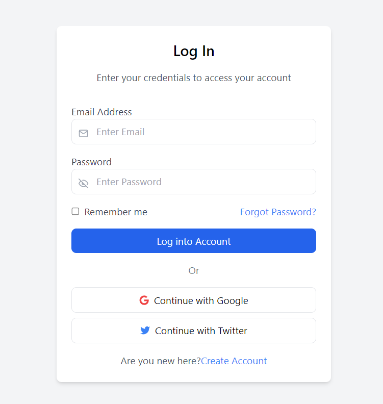
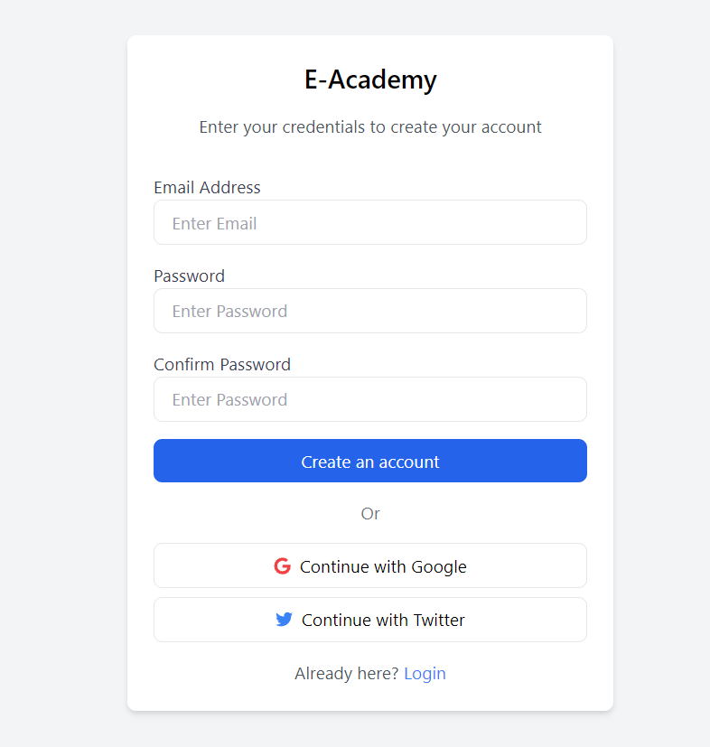

### E-Academy Login Page
This is a frontend project built with Next.js and Tailwind CSS. It contains a mobile-responsive login page with email, password inputs, and social login options, as well as a simple dashboard page that is accessible upon successful login. This project was created for a frontend technical assessment.

## Project Structure

src/
├── app/
│   ├── login/
│   │   ├── page.js          # Main login page component
│   │   ├── dashboard.js     # Dashboard page component (post-login)
│   ├── globals.css          # Global styles including Tailwind CSS
├── styles/
│   ├── globals.css          # Global styles imported in the project
│   ├── tailwind.config.js   # Tailwind configuration file

## Installation
1. Clone the repository:
git clone https://github.com/Himanshu-Bhundere/E-Academy-Login-Page.git
cd yourprojectname

2. Install dependencies:
npm install

3. Run the development server:
npm run dev

4. Open http://localhost:3000 to view the app in your browser.

## Login Page

## Dashboard Page

Notes
Make sure to have Tailwind CSS configured in tailwind.config.js to work with Next.js 13.
